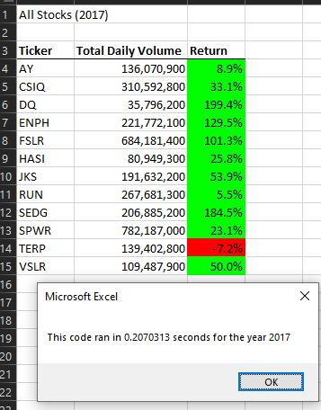
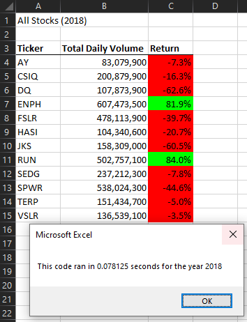

# stock-analysis
## **Project Overview**
The purpose of this script is to print out the Total Daily Volume for each ticker and show how the stock performed from the start to the end of the selected year (2017 or 2018).

## **Results 2017 vs 2018**
2017 
2018 

##Summary
By refactoring this code, we were able to make the code run much faster. A disadvantage to refactoring would be that it can be time consuming and may potentially break your code.
